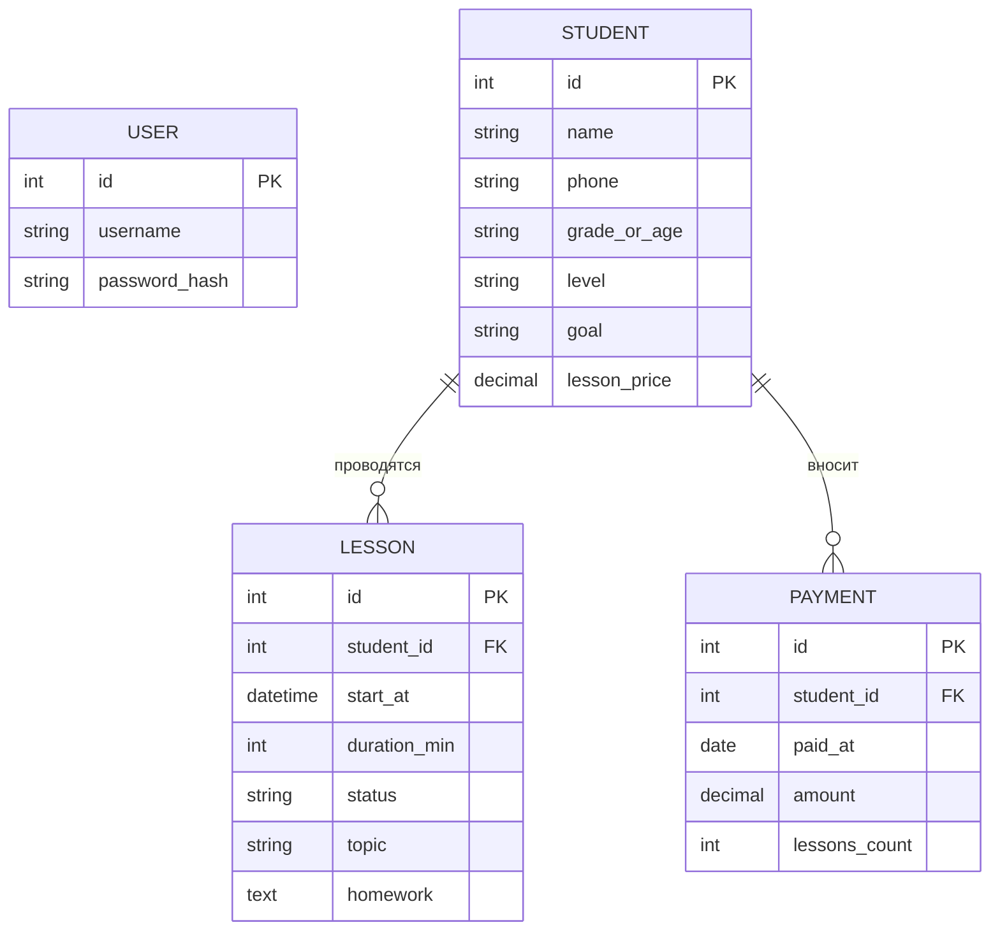

# Техническое задание

## 1. Назначение и область применения

Система предназначена для частного репетитора и объединяет в одном веб-приложении учёт учеников, расписание занятий, оплаты и историю обучения. Она заменяет разрозненные инструменты (заметки телефона, Google Calendar, таблицу Excel, поиск по переписке) и автоматизирует расчёт остатка оплаченных занятий.

Область применения: индивидуальная репетиторская практика, один преподаватель, до 100 учеников. Цели и критерии успеха приведены в [interview.md](interview.md), перечень требований в [requirements.md](requirements.md).

## 2. Роли пользователей и права доступа

| Роль | Описание | Права |
|---|---|---|
| Репетитор (владелец) | Единственный пользователь системы | Полный доступ ко всем функциям и данным: ученики, расписание, занятия, оплаты, история |
| Неавторизованный посетитель | Любой, кто не вошёл в систему | Доступна только страница входа |

Ученики в системе не работают. Регистрация новых пользователей через интерфейс не предусмотрена, учётная запись репетитора создаётся администратором при развёртывании.

## 3. Функциональные модули

| Модуль | Назначение | Требования |
|---|---|---|
| Аутентификация | Вход, выход, защита страниц | FR-01 – FR-03 |
| Ученики | Карточка, список, поиск, редактирование, удаление, экран «всё в одном месте» | FR-04 – FR-09 |
| Расписание | Создание, перенос, отмена занятий, просмотр по дням и неделям, контроль пересечений | FR-10 – FR-14 |
| Проведённые занятия | Отметка «проведено», тема, домашнее задание, история занятий | FR-15 – FR-17, FR-22 |
| Оплаты | Запись оплат, история, расчёт остатка, индикация нулевого остатка | FR-18 – FR-21 |

## 4. Сущности данных и связи

### 4.1. Описание сущностей

**User** (репетитор): id, логин, хэш пароля, дата создания.

**Student** (ученик): id, имя, телефон, класс или возраст, уровень английского, цель обучения, стоимость занятия, дата создания.

**Lesson** (занятие): id, student_id, дата и время начала, длительность в минутах, статус (`planned`, `completed`, `cancelled`), тема, домашнее задание, дата создания.

**Payment** (оплата): id, student_id, дата оплаты, сумма, число оплаченных занятий.

### 4.2. Связи

- Один ученик имеет много занятий (1 : N).
- Один ученик имеет много оплат (1 : N).
- При удалении ученика каскадно удаляются его занятия и оплаты (FR-06).
- Остаток оплаченных занятий не хранится, а вычисляется: сумма `Payment.lessons_count` минус число занятий со статусом `completed`.

### 4.3. Бизнес-правила

1. Остаток = Σ оплаченных занятий − число занятий со статусом `completed`.
2. Отменённое занятие в остаток не входит.
3. Остаток может быть отрицательным (занятие проведено в долг), в этом случае он выделяется визуально.
4. Повторная отметка уже проведённого занятия остаток не меняет.
5. Два занятия не могут пересекаться по времени без явного подтверждения репетитора.

## 5. Внешние интеграции

В первой версии внешних интеграций нет. Интеграция с Google Calendar, WhatsApp и Telegram вынесена за рамки (Out of scope). Архитектура не должна мешать добавить их позже: бизнес-логика расписания отделена от интерфейса.

## 6. Технологический стек и обоснование

| Компонент | Выбор | Почему |
|---|---|---|
| Язык и фреймворк | Python 3.12 + Django 5 | Встроенные аутентификация, сессии, защита от CSRF и XSS и ORM закрывают NFR-02 и NFR-03 без самописного кода. Один пользователь и около десятка экранов не требуют отдельного фронтенда на SPA-фреймворке |
| База данных | PostgreSQL 16 | Надёжная реляционная БД: данные строго структурированы (ученик, занятие, оплата), нужны связи и транзакции для корректного пересчёта остатка. Поддерживает утилиту резервного копирования `pg_dump` (NFR-04) |
| Интерфейс | Серверные шаблоны Django + Bootstrap 5 | Адаптивная вёрстка из коробки обеспечивает работу на ноутбуке и смартфоне (NFR-06) без отдельного мобильного приложения. Заказчик не просит сложной интерактивности |
| Расписание на экране | Библиотека FullCalendar (подключается как статический файл) | Готовые виды «день» и «неделя», знакомые пользователю по Google Calendar, что снижает время освоения (NFR-07) |
| Развёртывание | Docker Compose (Django + Gunicorn, PostgreSQL, Nginx) на VPS | Воспроизводимая установка одной командой, лёгкий перенос. Nginx выдаёт HTTPS-сертификат Let's Encrypt (NFR-02) |
| Резервные копии | `pg_dump` по cron, хранение 14 дней | Простое решение, достаточное для одной небольшой базы (NFR-04) |
| Тестирование | pytest + Django test client, Locust для нагрузки | Автоматическая проверка бизнес-правил расчёта остатка и нагрузочных требований NFR-01 |
| Контроль версий | Git, GitHub | Требование задания |

Почему не другие варианты: Google Sheets/Excel не решают проблему разрозненности и не дают контроль пересечений; SPA на React с отдельным API усложняет проект, не давая пользы единственному пользователю; SQLite достаточна по нагрузке, но PostgreSQL выбран из-за надёжности при одновременных записях и привычного инструментария резервного копирования.

## 7. Ограничения и допущения

**Ограничения**

- Система работает через браузер, данные хранятся в базе данных, обязательна авторизация.
- Данные учеников не должны быть доступны посторонним и не передаются сторонним сервисам.
- Интеграция с существующими инструментами в первой версии не обязательна.
- Один пользователь, до 5 одновременных сессий (одна учётная запись с ноутбука и смартфона).

**Допущения (будут проверены с заказчиком)**

- Занятие списывается при отметке «проведено», отменённое не списывается. Правило для поздней отмены не определено.
- Абонементы на месяц в первой версии не поддерживаются, оплата выражается числом занятий.
- Все занятия индивидуальные, групповых занятий нет.
- Данные из текущей таблицы Excel вносятся вручную.
- Бюджет и сроки в интервью не обсуждались. Предполагается недорогой VPS и разработка в рамках семестра.
- Стоимость занятия хранится в карточке для справки и в расчёте остатка не участвует.
